## TRADING CARD GAME UNION ARENM ユニオンアリーナ

## Official Rule Manual

Ver1.1

## Contents

Game Summary ...... 01
The Cards ...... 01
  <Character Cards> ...... 01
  <Site Cards> ...... 02
  <Event Cards> ...... 03
  <AP Cards> ...... 03
Your Field ...... 04
Decks ...... 05
Preparing to Play ...... 05
Winning the Game ...... 05
Active and Resting ...... 06
Game Flow ...... 07
  <Start Phase> ...... 08
  <Movement Phase> ...... 08
  <Main Phase> ...... 09
  <Attack Phase> ...... 11
  <End Phase> ...... 13
Keyword Abilities ...... 14
Game Terms ...... 15

## Game Summary

Union Arena is a trading card game designed for two-player competition. Construct your own deck using characters from your favorite anime, games, or series, then battle against your opponent. If you can reduce their life to zero first, you win.

## The Cards

## Character Cards

Character cards attack and block. When you play them onto your field, place them set to resting (horizontal).

You can play character cards onto either your energy line or your front line, and they can later be moved during your movement phase.

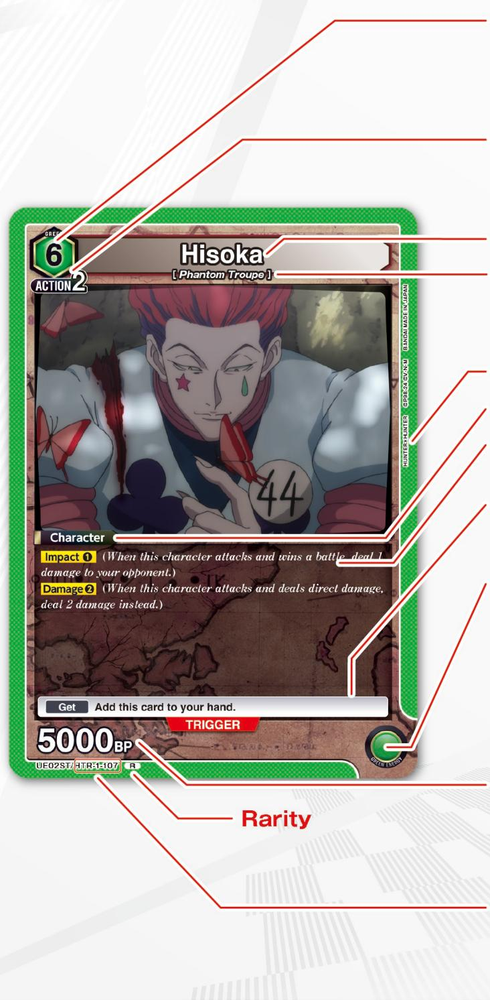

Required Energy : A requirement for using the card. When playing character cards, confirm their required energy color and number. Your energy line must be generating that amount of energy or more in the appropriate color.
The color of the required energy determines the card's color.

AP Cost (Action Point Cost): The number of action points (AP) that are spent when using the card. You can play character cards onto your field by switching this number of AP cards to resting.

## Card Name

Affinities : A list of the affinities the character card possesses. Refer to this list when performing Raid or when instructed to do so by abilities on other cards.
\* Not all cards possess affinities.

## Name of the Source Material

## Card Type

Abilities : The particular abilities possessed by this character card.

Trigger : This ability can be activated when the card is in your life area and you reveal it by turning the card face up after taking damage. (Activation is optional.)

Energy Generation : Refer to these icons when using other cards. The number of energy generation icons present on your energy line determines how much energy you are generating in each of those colors.

A plus sign next to the energy generation icon indicates that the card has an effect that may increase the amount of its energy generation.

\* Energy generation icons belonging to cards on the front line are ignored.

BP (Battle Points): This value is primarily used during battles. Sideline any character that has their BP reduced to zero or less by an ability. BP values may be accompanied by a plus sign if abilities on that card have the potential to increase it.

Card Number : No more than four cards with the same card number may be included in a deck.

## Site Cards

Site cards generally provide support while they are on your field. When you play them onto your field, place them set to resting (horizontal). Site cards can only be played onto your energy line. They cannot be moved to your front line.

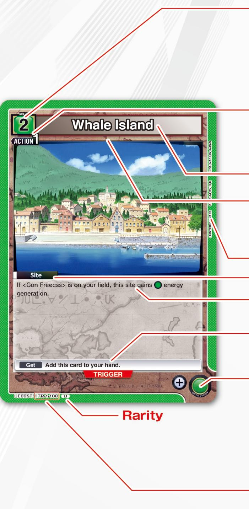

## Rarity

Required Energy : A requirement for using the card. When playing site cards, confirm their required energy color and number. Your energy line must be generating that amount of energy or more in the appropriate color.
The color of the required energy determines the card's color.

AP Cost (Action Point Cost) : The number of action points (AP) that are spent when using the card. You can play site cards onto your field by switching this number of AP cards to resting.

## Card Name

Affinities : A list of the affinities the site card possesses. Refer to this list when instructed to do so by abilities on other cards.
\* Not all cards possess affinities.

Name of the Source Material

## Card Type

Abilities : The particular abilities possessed by this site card.

Trigger : This ability can be activated when the card is in your life area and you turn it face up after taking damage. (Activation is optional.)

Energy Generation : Refer to these icons when using other cards. The number of energy generation icons present on your energy line determines how much energy you are generating in each of those colors.

A plus sign next to the energy generation icon indicates that the card has an effect that may increase the amount of its energy generation.

Card Number : No more than four cards with the same card number may be included in a deck.

## Event Cards

Use event cards to activate their abilities. Afterwards, place these cards into your sideline.

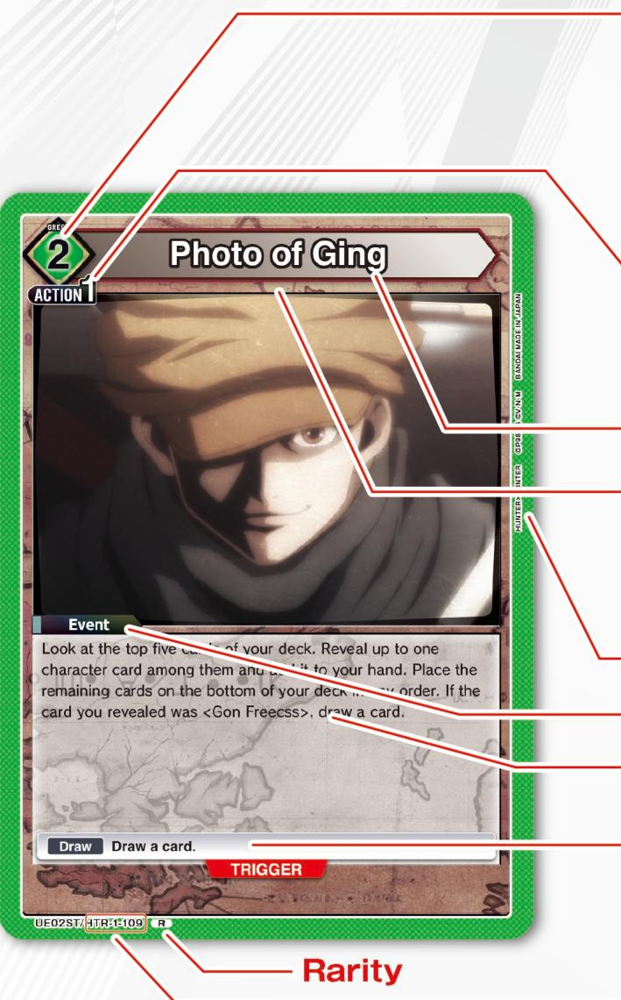

Required Energy : A requirement for using the card. When using event cards, confirm their required energy color and number. Your energy line must be generating that amount of energy or more in the appropriate color.
The color of the required energy determines the card's color.

AP Cost (Action Point Cost) : The number of action points (AP) that are spent when using the card. You can use event cards by switching this number of AP cards to resting.

## Card Name

Affinities : A list of the affinities the event card possesses. Refer to this list when instructed to do so by abilities on other cards.
\* Not all cards possess affinities.

## Name of the Source Material

## Card Type

Abilities : The particular abilities possessed by this event card.

Trigger : This ability can be activated when the card is in your life area and you turn it face up after taking damage. (Activation is optional.)

Card Number : No more than four cards with the same card number may be included in a deck.

## AP Cards

AP cards (action point cards) are primarily used for paying the action points (AP) needed when using other cards.
To pay 1 AP, take one active (vertical) AP card and switch it to resting (turn it horizontally).

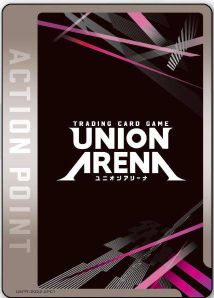

# Your Field

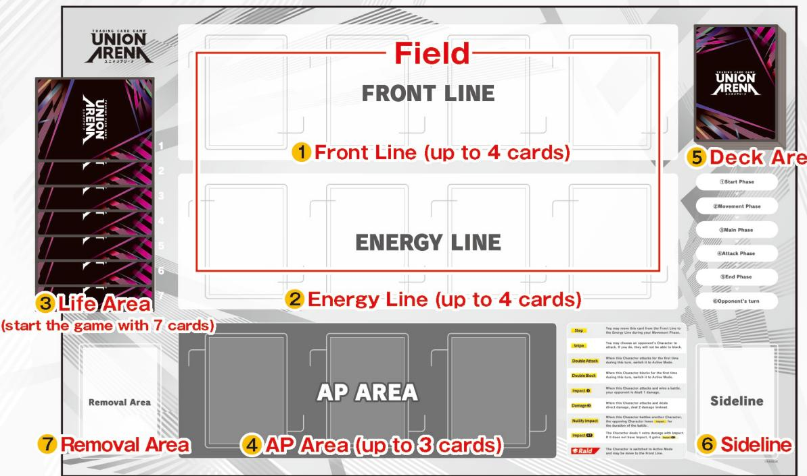

## 1 Front Line

You can place character cards onto your front line and then use those characters to attack and block.

Up to four character cards can be placed onto your front line.

\* Site cards cannot be placed onto the front line.

## 2 Energy Line

You can place both character and site cards onto your energy line. Only energy generation from cards on the energy line can be used to fulfill the required energy of other cards.
Up to four character or site cards in any combination can be placed onto your energy line.
\* Your front line and your energy line together are called your field.

## 3 Life Area

Your life area is where you place the cards that represent your life. Start each game with seven cards placed face down in your life area.

## 4 AP Area (Action Point Area)

Place your AP cards here.

## 5 Deck Area

Place your deck here.

## 6 Sideline

Used event cards as well as sidelined character and site cards are all placed here face up.

## 7 Removal Area

Cards you are instructed to place into your removal area are placed here face up. Once a card has been placed into your removal area, it is essentially removed from the game permanently.

## Decks

The following items are required to play Union Arena.

## ● A deck containing exactly 50 cards, constructed according to the rules listed below.

\- All cards must possess the same source material code (the first three letters of the card number).

\- No more than four copies of any cards with the same card number.
For example, if you are using the card UA03BT/HTR-1-001 in your deck, you may include up to 4 cards with the card number HTR-1-001, and all 50 cards in your deck must have the source material code HTR.

\- Cards with SPECIAL COLOR and FINAL triggers are restricted to no more than four cards for each trigger type.
For example, if Card A and Card B both have SPECIAL triggers, then the combined total of Card A and Card B in a deck cannot exceed four copies.

## - Three AP cards.

## Preparing to Play

1 Shuffle your deck and place it in the deck area.

2 Determine Player One and Player Two by using a method such as rock paper scissors.

3 Draw seven cards from your deck to create your starting hand.

4 You may mulligan your starting hand one time if desired. If you choose to draw a new hand, place your initial hand on the bottom of the deck and draw seven new cards. Then, reshuffle your deck.

\* Player One decides first if they will mulligan, followed by Player Two.

5 Take seven cards from the top of your deck and place them face down into your life area without revealing them.

6 Begin play with Player One taking their first turn.

## Winning the Game

You win the game if either of the following conditions occurs.

\- Your opponent has no cards remaining in their life area.

\- Your opponent has no cards remaining in their deck during their start phase and is therefore unable to draw a card.

Characters and sites on your field are “active” when placed vertically and “resting” when placed horizontally.

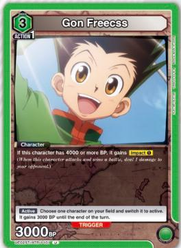  
Active

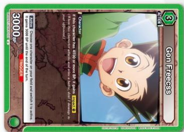  
Rest

Character cards and site cards are played onto your field set to resting. Only active characters can attack or block, and you switch them to resting when you perform an attack or block.

# Game Flow

## Player One takes the first turn. Turns proceed in the following order.

## Start Phase

1 Abilities that state they are active until the start of your next turn, and other similarly phrased abilities, become inactive.

2 Switch all of your resting cards (characters, sites, and AP cards) to active.

3 Make sure you have the appropriate number of AP cards in your AP area for the current turn.
(More details on the next page.)

4 Draw a card. (Player One does not draw a card on their first turn.)

5 Once per turn, you may pay 1 AP to take an extra draw if you wish, drawing one additional card. To pay 1 AP, take one active AP card and switch it to resting.
(Player One may take an extra draw on their first turn.)

## Movement Phase

You may move as many characters as you like from your energy line to your front line.

\* If a movement destination already holds four cards and has no space available, choose one card on that destination for each character you wish to move and place the chosen cards into your removal area first.

\* Sites cannot be moved.

## Main Phase

You may perform actions A and B listed below any number of times and in any order you like.

A : Use a Card

\- Play a character card

•Perform Raid with a character card

\- Play a site card

\- Use an event card

Cards in your hand can be used if you have the required energy and pay their AP cost. Play character cards and site cards onto your field set to resting.

## B: Use the Activate: Main Ability of a Card on Your Field

You can activate abilities labeled Activate: Main on cards on your field by fulfilling their requirements.

## Attack Phase

You can attack with one active character on your front line at a time, and you must switch it to resting when it attacks. If you still have active characters after you complete an attack, you may attack with those characters in the same manner.

\* You may only target your opponent (the player) with your attack.

\* Cards cannot be used during your attack phase.

\* You do not pay AP when attacking.

## End Phase

1 If there are any abilities that activate at the start of the end phase, activate and resolve them now.

2 Switch all resting characters and sites on your field to active.

3 If you have more than eight cards in your hand, choose eight cards to keep. Place the remaining cards into your removal area.

4 Any abilities that state they are active until the end of the turn now become inactive.

## The Opponent's Turn Begins

## 1 Start Phase

Proceed through the start phase in the following order.

1 Abilities that state they are active until the start of your next turn, and other similarly phrased abilities, become inactive.

2 Switch all of your resting cards (characters, sites, and AP cards) to active.

3 Make sure the number of AP cards in your AP area matches the number listed in the table below. Set AP cards to active when placing them.

\* The number of cards varies for Player One and Player Two.

<table><tr><td></td><td>Turn 1</td><td>Turn 2</td><td>Turn 3</td></tr><tr><td>Player One</td><td>1 card</td><td>2 cards</td><td>3 cards</td></tr><tr><td>Player Two</td><td>2 cards</td><td>2 cards</td><td>3 cards</td></tr></table>

4 Draw a card. (Player One does not draw a card on their first turn.)

5 You may pay 1 AP to draw one additional card if you wish (extra draw). (Once per turn)
(Player One may take an extra draw on their first turn.)

## 2 Movement Phase

You may move as many characters as you like from your energy line to your front line during your movement phase, but you may not move characters from your front line to your energy line.

All movements occur simultaneously.

\* Sites cannot be moved.

\* Characters with Step can be moved from the front line to the energy line.

\* If a movement destination already holds four cards and has no space available, choose one card on that destination for each character you wish to move and place the chosen cards into your removal area first. Movements occurring outside of the movement phase are handled the same way.

\* If you are moving a character with Step from your front line to your energy line and the destination is full, you may choose to have it trade places with another character on your energy line rather than placing that other character into your removal area.

\* Characters without Step cannot be moved to the energy line.

Example:

▼ field

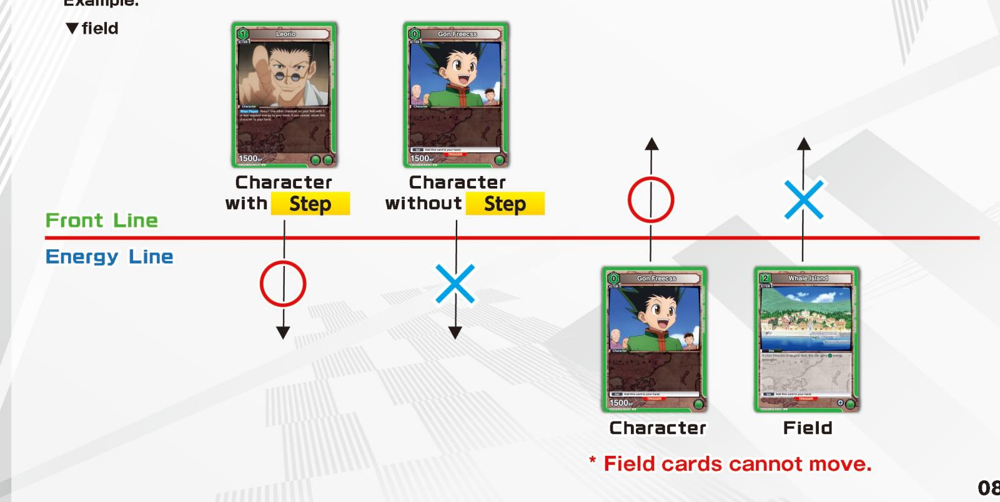  
\* Field cards cannot move.

## 3 Main Phase

## A : Use a Card

## Playing Character Cards

You can play character cards from your hand onto either your front line or your energy line.

Start by confirming that you have the required energy for the character card you wish to play. Your energy line must be generating enough energy in the same color as the required energy shown on that card.

Next, pay the AP cost of the character card you wish to play.

Do so by switching that number of active AP cards to resting.

Finally, place the desired character card from your hand set to resting onto either your energy line or your front line.

## Example:

## ▼Field

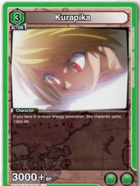  
\* Energy Generation doesn't count for cards on your Front Line.

## Front Line

## Energy Line

▼Hand  
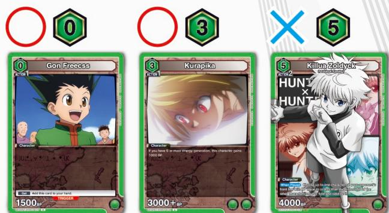

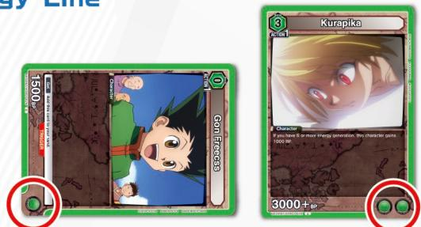

## The total Required Energy is ⚪x3

  
You have 🟢x3 Energy Generation on your field, so a card with a Required Energy of 🟢 or less from your hand will satisfy the Required Energy conditions.

\* When playing a character card, if the destination line already holds its maximum of four cards, start by placing one card from that line into your removal area. Cards on the field can only be placed into your removal area when a line is full.

## Performing Raid with a Character Card

In addition to playing them normally, character cards with Raid may be used to perform Raid. You can do so by declaring a Raid and placing the card on top of a specified character that does not possess Raid.

Character specifications are listed to the right of the Raid symbol, and their type can vary depending on the enclosing brackets.

<ABC> indicates cards with the name ABC.

Example:

[XYZ] indicates cards with the affinity XYZ.

Raid <Gon Freecss> Switch to active. May move to the front line.

\* When performing Raid with a card in your hand, you must have the required energy for that card and pay its AP cost.

\* You cannot perform Raid using an ability that instructs you to "play" a card. You can only perform Raid using abilities that instruct you to "perform Raid."

Follow the steps below when performing Raid.

1 Place the card on top of a specified character.

2 Abilities applying to the character under the Raid card no longer apply, and abilities on that character become inactive.

3 If the character is resting, switch it to active.

4 That character may be moved to the front line if it is on the energy line.

5 When Played abilities on the character performing Raid activate.

\* Cards with 📄 Raid may also be played normally. However, any abilities contained within the 📄 Raid description are lost.

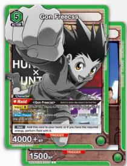

## Front Line

## Energy Line

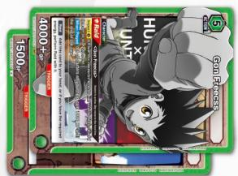  
Raid Boost a card
by stacking the cards!  
You can switch the powered up Character to Active Mode and move it to your Front Line!

## Playing Site Cards

Site cards in your hand may be played onto your energy line.

Start by confirming that you have the required energy for the site card you wish to play.
Your energy line must be generating enough energy in the same color as the required energy shown on that card.

Next, pay the AP cost of the site card you wish to play.

Do so by switching that number of active AP cards to resting.

Finally, place the desired site card from your hand set to resting onto your energy line.

\* When playing a site card, if the energy line already holds its maximum of four cards, start by placing one card from that line into your removal area. Cards on the field can only be placed into your removal area when a line is full.

\* Site cards cannot be played onto the front line.

## Using Event Cards

You can use event cards from your hand and activate their abilities.

Start by confirming that you have the required energy for the event card you wish to use.

Your energy line must be generating enough energy in the same color as the required energy shown on that card.

Next, pay the AP cost of the event card you wish to use.

Since event cards are not placed onto your field, you can use them regardless of whether your front line and energy line are full.

Do so by switching that number of active AP cards to resting.

Finally, activate the ability on the event card. After that ability is resolved, place the event card into your sideline.

## B : Use the Activate: Main Ability of a Card on Your Field

You can activate abilities labeled Activate: Main on cards on your field by fulfilling their conditions.
Abilities that state Once Per Turn can be activated one time during that turn for each copy of the card with that ability on your field.

\* If you remove a card from your field after activating its Once Per Turn ability, then play it onto your field again, it is treated as a separate card, so the Once Per Turn ability may be used one more time.

Examples) Activate: Main

Simply declare activation to activate the ability.

Activate: Main Switch to Resting

Switch this active card to resting to activate the ability.

Activate: Main Place①CardFromHandIntoSideline

Place one card from your hand into your sideline to activate the ability.

Activate: Main Pay①AP

Pay 1 AP to activate the ability.

Activate: Main SidelineThisCard

Sideline this card to activate the ability.

When several conditions are present, all of them must be fulfilled in order to activate the ability.

Example)

## Activate: Main SwitchtoResting Pay①AP SidelineThisCard

Switch this active card to resting, pay 1 AP, and sideline the card to activate the ability.

## 4 Attack Phase

During this phase, you can choose to attack your opponent with characters on your front line. If there is no action taken, the phase immediately ends.

Attack Phase Flow

Proceed through the actions listed below.

## Attacking Character Declaration

Select an active character on your front line to attack with, then switch that character to resting in order to attack your opponent with it.

If the character has Snipe, you may instead target a character on your opponent's front line to attack. If the attacking character has any When Attacking abilities, or any other abilities that activate when it attacks, resolve them now.

## Blocking Character Declaration

The attacked player may choose to block that attack with a character. They do this by selecting an active character on their front line as a blocker and switching it to resting.

If no blocker is selected, resolve any abilities on the attacking character that activate when not blocked. Otherwise, resolve any When Blocking abilities on the blocking character.

\* When abilities such as Snipe target a character and it is therefore not blocking, When Blocking abilities and other abilities that normally activate during blocking will not activate.

Go to the next page.

## Attack Resolution

Resolve the attack in one of the following two manners, depending on the target of the attack.

## 【Attacking a Character】

A battle occurs. Compare the BP of both characters then follow resolution method A or B listed below, depending on the result.

\* Neither character's BP changes as a result of the battle.

## A: The BP of the Attacking Character is Equal to or Greater than the BP of the Character Being Attacked

The attacking character wins the battle and the character being attacked loses. Follow the steps below to finish resolving the battle.

① Sideline the character being attacked.

②Resolve any When Sidelined abilities on that character and any other abilities that activate when that character is sidelined.

③Resolve any of your abilities that activate when you win a battle.

Example: Impact ① , or any other abilities that activate when a character attacks and wins a battle.

## B:The BP of the Attacking Character is Less than the BP of the Character Being Attacked

The character being attacked wins the battle, and the attacking character loses. Follow the steps below to finish resolving the battle.

① Resolve any abilities that activate when your character attacks and loses a battle.

②Resolve any of your opponent's abilities that activate when they win a battle.

\* The attacking character is not sidelined after losing.

## After completing resolution method A or B, the battle ends. Perform the actions listed below.

\- If there are any abilities that activate at the end of the battle, resolve them now.

\- Any abilities that were active only for the duration of this battle now become inactive.

## [Attacking Your Opponent]

Deal 1 damage to your opponent. If your character has damage ②, deal 2 damage.

## ★When a Player Takes Damage★

The player dealing damage selects one card in the damaged player's life area for each point of damage dealt. The damaged player then checks for triggers on all of those cards.

If your opponent has no life remaining after they have finished checking for triggers, you win the game.

## Checking for Triggers

Turn the card face up and confirm whether or not it has a trigger. If it does, the player checking for triggers may activate its ability if they wish. The card is then placed into the owner's sideline after the trigger and its ability are resolved.

(Cards without triggers are also placed into the sideline.)

\* When checking for triggers on more than one card and multiple triggers are found, the player checking can activate them in any order they like. Each card is activated, resolved, then placed into the sideline, one at a time, before the next of the trigger abilities is activated.

If you wish to attack with another character, return to Attacking Character Declaration. Otherwise, end the attack phase.

## 5 End Phase

## Follow the steps listed below.

1 If there are any abilities that activate at the start of the end phase, activate and resolve them now.

2 Switch all of your resting characters and sites on your field to active.
\*Resting AP cards remain set to resting.

3 If you have more than eight cards in your hand, choose eight cards to keep.
Place the remaining cards into your removal area.

4 Any abilities that state they are active until the end of the turn now become inactive.

After all of the above steps are completed, your opponent's turn begins.

## - When Multiple Abilities Activate Simultaneously

When multiple abilities activate simultaneously during a game, the player controlling the cards with those abilities can resolve them in any order they like. When abilities belonging to both you and your opponent activate simultaneously, the player taking their turn resolves all of their abilities first, followed by the player not taking their turn.
\*If the resolution of one ability activates a new ability, that new ability is added to any remaining unresolved abilities and may also be resolved in any order desired.

## - When BP Becomes Zero or Less

When the BP of a character on the field is reduced to zero or less by an ability, that character is sidelined.

## - When a Raided Character on the Field Moves to a Destination Other than the Field

When a Raided character moves to a destination other than the field, move only the top card to that destination. Place the underlying card(s) into your sideline. Those cards are not treated as having been sidelined.

Example) When an ability returns a Raided character to your hand, return only the top card and place all underlying cards into your sideline.

## - Sidelining

A card is “sidelined” when it is moved from the field to your sideline after battle, after its BP is reduced to zero or less, or when an ability instructs you to sideline it. Cards are not treated as sidelined when abilities instruct you to “place” them into your sideline, or when they move to some destination other than your sideline, such as your hand or your removal area.

## - Abilities with the phrasing “{xyz} instead” are phrase substitution abilities.

When the indicated requirements are fulfilled, replace the text inside the first set of {} brackets with the text inside the second set of {} brackets when carrying out the ability.

Example: Consider the following ability. “{Choose up to one character on your opponent's front line and switch it to resting. It} will remain set to resting until the end of their next attack phase. If six or more other [Thirteen Court Guard Squads] affinity cards are on your field, {Choose up to one character on your opponent's front line. Switch it and all characters on your opponent's energy line to resting. They} instead.”

If you have five or less other [Thirteen Court Guard Squads] affinity cards on your field, the ability is “Choose up to one character on your opponent's front line and switch it to resting. It will remain set to resting until the end of their next attack phase.”

If you have six or more other [Thirteen Court Guard Squads] affinity cards on your field, the ability becomes “Choose up to one character on your opponent's front line. Switch it and all characters on your opponent's energy line to resting. They will remain set to resting until the end of their next attack phase.”

# Keyword Abilities

<table><tr><td>Step</td><td>During your movement phase, you may move this card from your front line to your energy line.* This movement occurs simultaneously with characters moving from your energy line to your front line.</td></tr><tr><td>Snipe</td><td>You may target a character on your opponent&#x27;s front line and attack it with this character. If you do, your opponent cannot block.* Characters on your opponent&#x27;s front line can be targeted whether they are active or resting.* The active or resting state of targeted characters does not change.* Characters targeted by Snipe do not block, so When Blocking abilities on those characters do not activate. However, a battle still occurs.* Characters with abilities that state they cannot be &quot;chosen&quot; by other abilities can still be targeted for attack.</td></tr><tr><td>Double Attack</td><td>When this character attacks for the first time this turn, switch it to active.</td></tr><tr><td>Double Block</td><td>When this character blocks for the first time this turn, switch it to active.</td></tr><tr><td>Impact 1</td><td>When this character attacks and wins a battle, deal 1 damage to your opponent.*Even if a character gains Impact 1 twice, it still only has Impact 1.</td></tr><tr><td>Impact +1</td><td>Increase Impact damage by 1. If the card does not have Impact, it gains Impact 1.</td></tr><tr><td>damage 2</td><td>When this character attacks and deals direct damage, deal 2 damage instead.* Select two cards in your opponent&#x27;s life. Your opponent will turn them both over and check for triggers at the same time.* Even if a character gains damage 2 twice, it still only has damage 2.</td></tr><tr><td>damage +1</td><td>When this character attacks and deals direct damage, deal 1 additional damage.</td></tr><tr><td>Nullify Impact</td><td>The character battling this character loses Impact for the duration of this battle.</td></tr></table>

# Game Terms

## Activation Timing Examples

<table><tr><td>When Played</td><td>Activates when you play the card onto your field.This ability also activates when the card performs Raid due to a trigger, or when an ability, either on the card or otherwise, plays the card onto the field, even during your opponent&#x27;s turn.</td></tr><tr><td>When Sidelined</td><td>Activates when the card is sidelined.</td></tr><tr><td>When Attacking</td><td>Activates when the card attacks.</td></tr><tr><td>When Blocking</td><td>Activates when the card blocks.</td></tr><tr><td>During Your Turn</td><td>Stays active for the duration of your turn.</td></tr><tr><td>During Opponent&#x27;s Turn</td><td>Stays active for the duration of your opponent&#x27;s turn.</td></tr></table>

## Activation Conditions

Below are some examples of conditions necessary for activating abilities.
An ability will not activate unless all of the conditions listed on it are fulfilled.

<table><tr><td>If on the Front Line</td><td>Activates when this card is on the front line.</td></tr><tr><td>If on the Energy Line</td><td>Activates when this card is on the energy line.</td></tr><tr><td>Switch to Resting</td><td>Activated by switching this active card to resting.</td></tr><tr><td>Place 1 Card From Hand Into Sideline</td><td>Activated by placing n cards from your hand into your sideline.</td></tr><tr><td>Pay 1 AP</td><td>Activated by paying n AP.</td></tr><tr><td>Sideline This Card</td><td>Activated by sidelining this card.</td></tr><tr><td>Once Per Turn</td><td>Can only be activated one time each turn.
* If multiple copies of this card are on the field, each copy of the ability can activate one time each turn</td></tr></table>